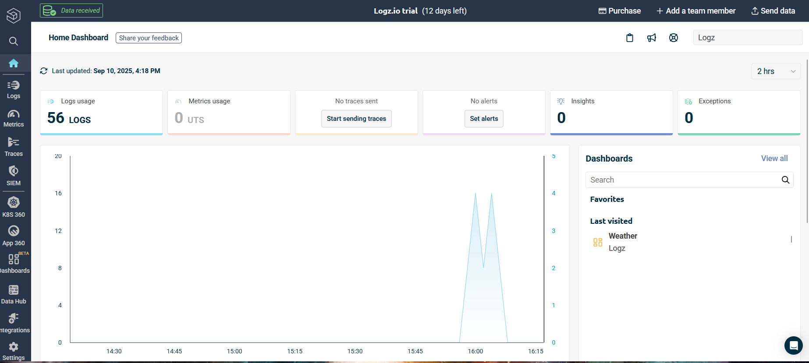
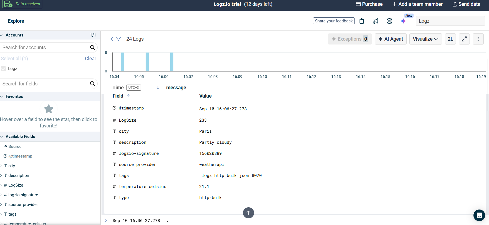

# Weather Data Shipper

A multi-source weather data polling and shipping application that continuously collects weather data from multiple sources, transforms it to a unified format, and ships it reliably to Logz.io.




## 🎯 Overview

This command-line application performs the following operations in a continuous loop:

- **Polls** weather data from multiple sources (APIs and local files)
- **Transforms** data into a unified JSON format
- **Ships** batched data to Logz.io for monitoring and analysis

### Supported Data Sources

- **OpenWeatherMap API** - Real-time weather data
- **WeatherAPI.com** - Alternative weather API service
- **CSV Files** - Local weather data files

## 📋 Requirements

- Python 3.8+
- Active API keys for weather services
- Logz.io account with shipping token

## 🚀 Quick Start

### 1. Clone the Repository

```bash
git clone https://github.com/YOUR_USERNAME/weather-data-shipper.git
cd weather-data-shipper
```

### 2. Set Up Virtual Environment

```bash
python -m venv venv

# Windows
venv\Scripts\activate

# Linux/Mac
source venv/bin/activate
```

### 3. Install Dependencies

```bash
pip install -r requirements.txt
```

### 4. Configure Environment Variables

Create a `.env` file in the project root:

```bash
# Weather API Keys
OPENWEATHER_API_KEY=your_openweathermap_api_key_here
WEATHERAPI_API_KEY=your_weatherapi_com_api_key_here

# Logz.io Configuration
LOGZ_IO_TOKEN=your_logz_io_shipping_token_here

# Optional: Override Logz.io host (default: listener.logz.io)
# LOGZ_IO_HOST=listener-eu.logz.io
```

### 5. Run the Application

```bash
python main.py
```

The application will start continuous polling every 60 seconds. Press `Ctrl+C` to stop gracefully.

## ⚙️ Configuration

### YAML Configuration (`config/config.yaml`)

```yaml
# Polling interval in seconds
polling_interval: 60

# Data sources configuration
data_sources:
  - type: openweathermap
    cities: ["Berlin", "London", "Tokyo"]
    enabled: true

  - type: weatherapi
    cities: ["Sydney", "Paris", "New York"]
    enabled: true

  - type: csv
    file_path: "./weather_data.csv"
    enabled: true

# Logz.io endpoint configuration
logz_io:
  host: "listener.logz.io" # Will be overridden by LOGZ_IO_HOST env var
  port: 8071

# Network and reliability settings
network:
  request_timeout: 15 # API request timeout in seconds
  retry_attempts: 3 # Number of retry attempts
  retry_delay_base: 2 # Base delay for exponential backoff (2s, 4s, 8s)

# Data processing settings
data_processing:
  batch_size: 100 # Maximum records per batch
  skip_invalid_records: true
  max_consecutive_failures: 5

# Application behavior
application:
  shutdown_timeout: 30 # Time to wait for graceful shutdown
  persist_on_shutdown: true
  recovery_file: "./unsent_data.jsonl"
```

### Environment Variables

| Variable              | Description                      | Required |
| --------------------- | -------------------------------- | -------- |
| `OPENWEATHER_API_KEY` | OpenWeatherMap API key           | Yes      |
| `WEATHERAPI_API_KEY`  | WeatherAPI.com API key           | Yes      |
| `LOGZ_IO_TOKEN`       | Logz.io shipping token           | Yes      |
| `LOGZ_IO_HOST`        | Logz.io listener host (optional) | No       |

### CSV File Format

Create `weather_data.csv` in the project root:

```csv
city,temperature,description
Berlin,18.5,"Scattered clouds"
Sydney,22.1,"Sunny"
Tokyo,15.3,"Light rain"
```

## 📊 Data Format

### Unified Output Format

All data sources are transformed to this unified JSON format:

```json
{
  "city": "Berlin",
  "temperature_celsius": 22.86,
  "description": "clear sky",
  "source_provider": "openweathermap"
}
```

### Logz.io Shipping Format

Data is sent to Logz.io as newline-delimited JSON:

```
{"city": "Berlin", "temperature_celsius": 22.86, "description": "clear sky", "source_provider": "openweathermap"}
{"city": "London", "temperature_celsius": 17.99, "description": "scattered clouds", "source_provider": "openweathermap"}
```

## 🧪 Testing

### Run Unit Tests

```bash
# Run all tests
python -m pytest tests/ -v

# Run specific test file
python -m pytest tests/test_weather_transformer.py -v

# Run tests with coverage
python -m pytest tests/ --cov=src
```

### Manual Testing

```bash
# Test configuration loading
python test_phase1.py

# Test data sources individually
python test_csv_source.py

# Test complete transformation pipeline
python test_transformation_pipeline.py

# Test shipping to Logz.io
python test_shipping.py
```

## 🏗️ Project Structure

```
weather-data-shipper/
├── config/
│   └── config.yaml              # Main configuration file
├── src/
│   ├── config_loader.py         # Configuration loading logic
│   ├── data_sources/
│   │   ├── __init__.py         # Data source dispatcher
│   │   ├── csv_source.py       # CSV file reader
│   │   ├── openweathermap_source.py  # OpenWeatherMap API client
│   │   └── weatherapi_source.py      # WeatherAPI.com client
│   ├── transformers/
│   │   └── weather_transformer.py    # Data transformation logic
│   └── shipper/
│       └── logz_io_client.py    # Logz.io shipping client
├── tests/
│   └── test_weather_transformer.py  # Unit tests
├── main.py                      # Main application entry point
├── requirements.txt             # Python dependencies
├── weather_data.csv            # Sample CSV data
├── .env.example               # Environment variables template
├── .gitignore                 # Git ignore rules
└── README.md                  # This file
```

## 🔧 API Key Setup

### OpenWeatherMap API

1. Visit [OpenWeatherMap](https://openweathermap.org/api)
2. Sign up for a free account
3. Generate an API key from your dashboard
4. Add to `.env` as `OPENWEATHER_API_KEY`

### WeatherAPI.com

1. Visit [WeatherAPI.com](https://www.weatherapi.com/)
2. Sign up for a free account
3. Get your API key from the dashboard
4. Add to `.env` as `WEATHERAPI_API_KEY`

### Logz.io Setup

1. Sign up for a [Logz.io account](https://logz.io/)
2. Navigate to Settings → Manage tokens
3. Copy your shipping token
4. Add to `.env` as `LOGZ_IO_TOKEN`
5. Note your listener host (e.g., `listener-eu.logz.io` for EU)

## 🚨 Error Handling & Reliability

The application handles various failure scenarios:

- **Network Issues**: Automatic retry with exponential backoff
- **API Failures**: Continues with other sources, logs warnings
- **Invalid Data**: Skips bad records, continues processing
- **Logz.io Failures**: Retries shipping, saves data for recovery
- **Graceful Shutdown**: Attempts to send pending data on Ctrl+C

## 📈 Monitoring

### Application Logs

The application provides detailed console output:

- ✅ Successful operations
- ⚠️ Warnings for recoverable issues
- ❌ Errors for failures
- 📊 Statistics (records processed, shipped)

### Logz.io Dashboard

Monitor your data in Logz.io:

- Search for logs with your shipping token
- Filter by `source_provider` field
- Create visualizations for temperature trends
- Set up alerts for data anomalies

## 🐳 Containerization (Optional)

Build and run with Docker:

```bash
# Build image
docker build -t weather-data-shipper .

# Run container
docker run --env-file .env weather-data-shipper
```

## 🤝 Contributing

1. Fork the repository
2. Create a feature branch (`git checkout -b feature/new-source`)
3. Make your changes
4. Add tests for new functionality
5. Commit your changes (`git commit -am 'Add new weather source'`)
6. Push to the branch (`git push origin feature/new-source`)
7. Create a Pull Request

### Adding New Data Sources

To add a new data source:

1. Create a new file in `src/data_sources/`
2. Implement a `fetch_[source_name]_data()` function
3. Update `src/data_sources/__init__.py` to include the new source
4. Add configuration options to `config.yaml`
5. Add tests

## 📝 License

This project is licensed under the MIT License - see the [LICENSE](LICENSE) file for details.

## 🆘 Troubleshooting

### Common Issues

**"Configuration file not found"**

- Ensure `config/config.yaml` exists
- Check file permissions

**"Missing API key"**

- Verify `.env` file exists and contains valid keys
- Ensure environment variables are loaded

**"Connection refused to Logz.io"**

- Check your shipping token
- Verify the correct listener host for your region
- Ensure network connectivity

**"No data fetched"**

- Verify API keys are valid and have quota remaining
- Check CSV file exists and has correct format
- Review data source configuration

### Debug Mode

Add debug logging by setting environment variable:

```bash
export LOG_LEVEL=DEBUG
python main.py
```
